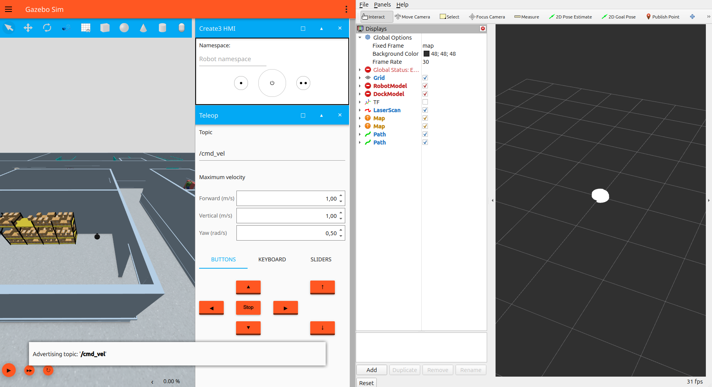
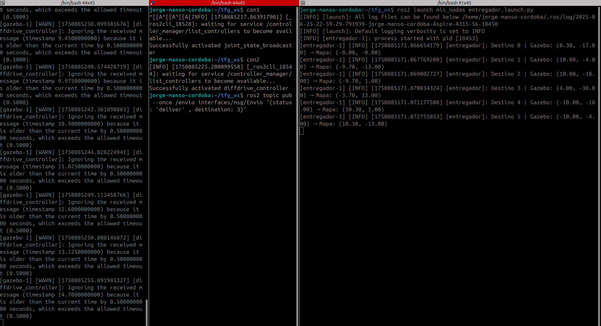
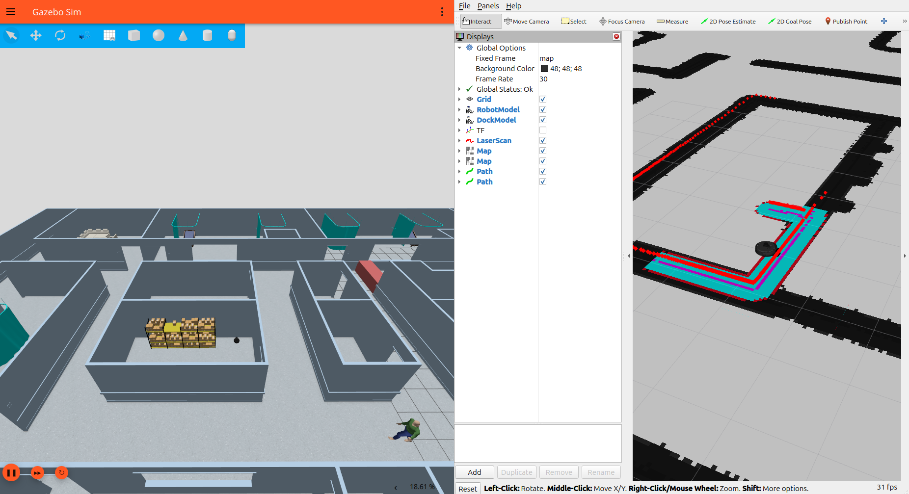

# TFG-Hospital Create3

This is a public repository which stores all the files required for the simulation of my final degree project: an autonomous robot that delivers medication in a hospital environment, as well as some useful instructions to use the package. Please feel free to make issues regarding doubts, whether they are ROS 2 Jazzy issues or package-specific questions.

I publish this project not only to show it to everyone, but also to improve it and keep learning.

## :pencil2: Authors :pencil2:
- Jorge Manso Córdoba, main developer.
- Ibone Lizarraga Mayo, tutor of the final degree project.
- Ángel López Gázquez,  contributor and overseer of the package.

## :raised_hands: Credits :raised_hands:
Thanks to Ángel López Gázquez for his invaluable guidance, and to the ROS and iRobot communities for their open-source tools.

## DISCLAIMER :exclamation:
This project was developed using **Ubuntu 24.04** with **ROS 2 Jazzy** and **Gazebo Harmonic**. Compatibility with other versions is not guaranteed.

## Install :book:

### First requirements 📋
##### ROS 2 Jazzy  
Follow the official guide: https://docs.ros.org/en/jazzy/Installation.html

##### Packages  
```
sudo apt install \
  ros-jazzy-nav2-bringup \
  ros-jazzy-slam-toolbox \
  ros-jazzy-gz-sim \
  ros-jazzy-gz-ros2-control \
  ros-jazzy-gz-plugins \
  ros-jazzy-xacro \
  ros-jazzy-turtlebot3-msgs \
  ros-jazzy-irobot-create-gz
```

#### Clone & build

```
cd ~/<your_workspace>/src
git clone https://github.com/Jorgegue2002/tfg.git
cd ..
rosdep install --from-paths src --ignore-src -r -y
colcon build
. install/setup.bash
```

## Full System Launch :rocket:
Make sure you have installed from source all the packages as shown in the section "Packages" above. Also, remember to source in each terminal your setup.bash from your workspace before using any commands provided next (from <your_workspace>):


### Mapping

In order to do SLAM with this package, make sure you installed from source Slam-Toolbox. We will launch slam toolbox with the parameters we provide inside nav2_create/config/mapper_params_online_async.yaml. You may want to change some parameters so you can see how it affects the navigation. Please feel free to try anything you want, remember this is a package provided to be a tutorial for starters in ROS2, while showing the project of the TFG.

#### Terminal A

```
ros2 launch bringup main.launch.py slam:=true
```
#### Terminal B

This terminal is used to mainly to activate the controllers of the Create3, but it can also be used later to send the destinations to the robot or to control it using the keyboard.

To activate the controllers:
```
ros2 control set_controller_state joint_state_broadcaster active
ros2 control set_controller_state diffdrive_controller active
```
#### Terminal C
To save the map yo move with this terminal to the place where you want to save it and you run:

```
ros2 run nav2_map_server map_saver_cli -f <name_of_the_map>
```

### Navigation
In order to use the navigation launch, please follow the next instructions.
#### Terminal A

```
ros2 launch bringup main.launch.py
```

- Launches Gazebo with hospital world + Create 3
- Launches RViz
- Launches Nav2
- Launches twist_mux and velocity converter

The world and Rviz should seem something like this.



#### Terminal B

This terminal is used to mainly to activate the controllers of the Create3, but it can also be used later to send the destinations to the robot or to control it using the keyboard.

To activate the controllers:
```
ros2 control set_controller_state joint_state_broadcaster active
ros2 control set_controller_state diffdrive_controller active
```

#### Terminal C

This node is the node in charge of the deliveries.

```
ros2 launch mis_nodos entregador.launch.py
```
Now the robot is ready to receive delivery orders.

The terminals how I use them look something like this.



#### Manual Control (Teleoperation) 🎮

You can take manual control. Teleop commands on /cmd_vel_teleop override Nav2’s /cmd_vel_nav thanks to twist_mux.

In my case I use teleop_twist_keyboard in Terminal B. To use it you have to install it with:

```
sudo apt install ros-jazzy-teleop-twist-keyboard
```

And use it with:
```
ros2 run teleop_twist_keyboard teleop_twist_keyboard --ros-args -r cmd_vel:=/cmd_vel_teleop
```

## Sending Delivery Orders 📩
The coordinates of the destinations are written in a dictionary in the node mis_nodos/mis_nodos/entregador.py, corresponding to the hospital's rooms.

To request a delivery:
```
ros2 topic pub --once /envio interfaces/msg/Envio "{status: 'deliver', destination: 3}"
```

When the robot receives a delivery, it moves to the destination and waits for a signal on the /robot_ready topic. If it is not activated manually, it will activate automatically after 30 seconds to proceed with the next order in the stack.
To simulate completion:
```
ros2 topic pub --once /robot_ready std_msgs/msg/Bool "{data: true}"
```

It should semm something like this.


